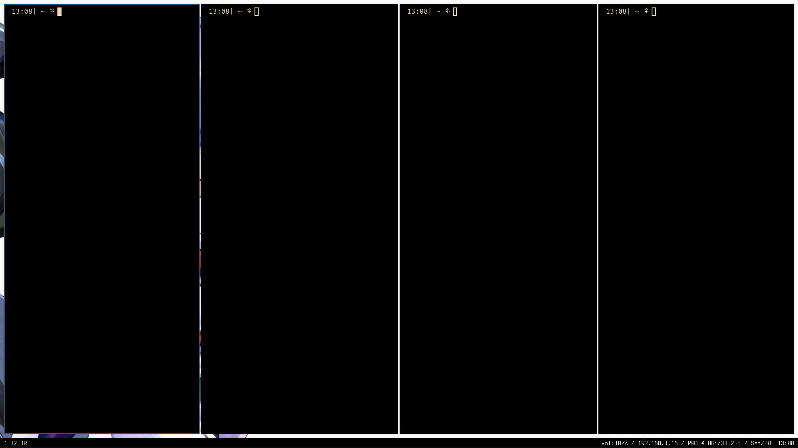
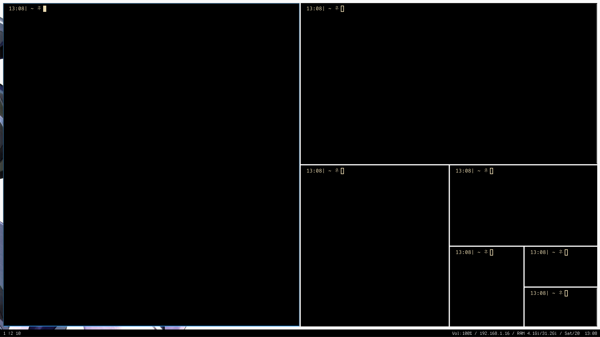

# AUTO TILING FOR I3 (C VERSION)

A lightweight, fast auto-tiling daemon for **i3 and sway**, written in **C**.
Inspired by the old Python auto-tiling script, but with minimal dependencies
and no python vm.
It uses 1.5~ Mb of ram.


---

## Installation

```bash
git clone https://github.com/piadi-sudo/i3-autotiling-in-c.git
cd i3-autotiling-in-c
sudo make install
```

### Uninstall

```bash
sudo make uninstall
```

---

## Configuration

### i3

Add the following line to your i3 config file:
`~/.config/i3/config`

```bash
exec_always --no-startup-id autotiling
```

### Sway

Add the following line to your Sway configuration file:

`~/.config/sway/config`

```bash
exec_always autotiling
```

---

## Screenshots

### Before Auto-Tiling



### After Auto-Tiling



---

## License

This project is released under the MIT License.

